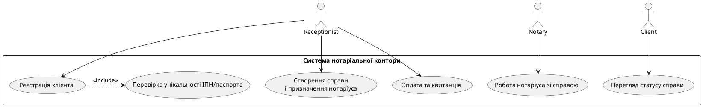
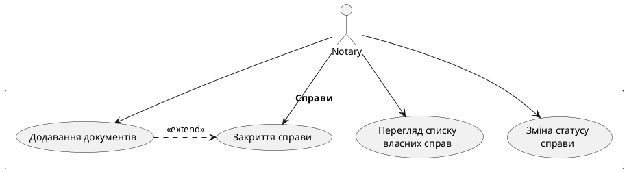

Нижче — цілісне технічне завдання на систему управління нотаріальною конторою (далі — Система). Усе спроєктовано під стек **HTML + CSS + PHP (без JavaScript)** і під вашу схему БД із 7 таблиць.

---

## 1. Business Description (Опис бізнесу)

Система автоматизує роботу нотаріальної контори, що має один або кілька офісів. Основні задачі:

* ведення **реєстру клієнтів** (фізичні особи);
* управління **нотаріусами та офісами**;
* облік **нотаріальних справ** (notarial_cases) по клієнтах та послугах;
* зберігання та завантаження **файлів документів** по справах;
* облік **платежів** за послуги та формування базової звітності;
* надання клієнту **онлайн-доступу** до статусу його справи та завантажених копій документів.

Система використовується співробітниками різних ролей (адмін, нотаріус, працівник приймальні, бухгалтер) через внутрішню панель, а також клієнтами через окремий «Кабінет клієнта» або спрощену форму перевірки статусу справи.

---

## 2. Actors (Ролі користувачів)

1. **Admin (Адміністратор офісу)**

   * Створює/редагує офіси.
   * Додає або деактивує нотаріусів.
   * Призначає нотаріуса до офісу.
   * Переглядає статистику по справах, послугах, платежах.

2. **Notary (Нотаріус)**

   * Бачить лише власні справи (прив’язані до notary_id).
   * Створює нові справи (або на основі введених даних від приймальні).
   * Змінює статус справи.
   * Додає документи до справи.
   * Закриває справу.

3. **Receptionist (Працівник приймальні)**

   * Реєструє клієнтів.
   * Перевіряє унікальність ІПН / паспорта.
   * Створює справу і призначає нотаріуса.
   * Створює платежі.
   * Друкує квитанції (HTML / PDF-генерація на сервері).

4. **Accountant (Бухгалтер)**

   * Переглядає всі платежі.
   * Фільтрує платежі за статусом / методом / датою.
   * Формує дохід за період.

5. **Client (Клієнт)**

   * Переглядає статус власних справ.
   * Завантажує копії документів, доступних для клієнта.

---

## 3. User Stories

### 3.1 Адміністратор офісу

* Як **адміністратор**, я хочу **створювати та редагувати офіси**, щоб підтримувати актуальну інформацію про назву, адресу та графік роботи.
* Як **адміністратор**, я хочу **додавати нових нотаріусів та деактивувати існуючих**, щоб контролювати, хто має доступ до системи.
* Як **адміністратор**, я хочу **призначати нотаріуса до конкретного офісу**, щоб справи розподілялися за реальними місцями роботи.
* Як **адміністратор**, я хочу **переглядати статистику (кількість справ, послуг, суму платежів за період)**, щоб оцінювати завантаженість офісів та доходи.

### 3.2 Нотаріус

* Як **нотаріус**, я хочу **бачити список лише моїх справ**, щоб зосередитися на власних клієнтах.
* Як **нотаріус**, я хочу **відкривати нові справи** для клієнтів, щоб фіксувати всі нотаріальні дії.
* Як **нотаріус**, я хочу **змінювати статус справи** (open / in_progress / closed / cancelled), щоб відображати реальний стан роботи.
* Як **нотаріус**, я хочу **додавати документи до справи**, щоб зберігати оцифровані файли та інформацію про видані/отримані документи.
* Як **нотаріус**, я хочу **закривати справу**, коли всі дії виконано і документи оформлені.

### 3.3 Працівник приймальні

* Як **працівник приймальні**, я хочу **реєструвати клієнтів у системі**, щоб вони могли отримувати послуги.
* Як **працівник приймальні**, я хочу **перевіряти унікальність ІПН / паспорта клієнта**, щоб уникнути дублювання записів.
* Як **працівник приймальні**, я хочу **створювати справу для клієнта і призначати відповідального нотаріуса**, щоб налаштувати правильний процес роботи.
* Як **працівник приймальні**, я хочу **створювати платежі за справами**, щоб фіксувати оплату послуг.
* Як **працівник приймальні**, я хочу **друкувати квитанції (HTML/PDF)** для клієнтів, щоб вони мали підтвердження оплати.

### 3.4 Бухгалтер

* Як **бухгалтер**, я хочу **переглядати всі платежі**, щоб контролювати фінансові потоки.
* Як **бухгалтер**, я хочу **фільтрувати платежі за статусом (pending/paid/cancelled/refunded)**, щоб аналізувати борги та повернення.
* Як **бухгалтер**, я хочу **формувати звіти по доходах за період**, щоб передавати інформацію керівництву / для податкової.

### 3.5 Клієнт

* Як **клієнт**, я хочу **переглядати статус своєї справи**, щоб розуміти, на якому етапі процес.
* Як **клієнт**, я хочу **завантажувати копії документів**, що стосуються моєї справи, щоб мати цифрові копії для власного використання.

---

## 4. Functional Requirements (Функціональні вимоги)

### 4.1 Управління клієнтами

* Створення / редагування / видалення (CRUD) записів клієнтів.
* Пошук клієнтів за:

  * прізвищем, ім’ям, по-батькові;
  * tax_id;
  * паспортом (серія + номер).
* Забезпечення **унікальності**:

  * (passport_series, passport_number) — унікальна пара.
  * tax_id — унікальне поле.
* Перегляд історії справ клієнта.

### 4.2 Нотаріуси

* CRUD нотаріусів (доступно адміністратору).
* Прив’язка нотаріуса до office_id.
* Унікальність license_number.
* Позначка is_active:

  * неактивний нотаріус не може бути призначений на нові справи.

### 4.3 Офіси

* Створення, редагування даних офісу (назва, адреса, місто, контакти, графік).
* Прив’язка нотаріусів до офісу.
* Статистика по офісу:

  * кількість відкритих/закритих справ за період;
  * сума платежів.

### 4.4 Справи (notarial_cases)

* Створення нової справи:

  * автоматична генерація **унікального case_number** (наприклад, `YYYY-XXXXXX`).
  * прив’язка до client_id, notary_id, service_id.
* Зміна статусу справи (open → in_progress → closed / cancelled).
* Логіка статусів:

  * **open** — щойно створена справа;
  * **in_progress** — нотаріус працює над справою;
  * **closed** — всі дії виконано, всі необхідні документи оформлені;
  * **cancelled** — справа закрита без результату.
* Автоматичне завершення:

  * якщо всі документи додані й позначено, що послуга виконана, нотаріус може одним натисканням змінити статус на closed.
* Перегляд історії платежів по справі.
* Перегляд документів по справі.

### 4.5 Документи (documents)

* Додавання документів до справи:

  * завантаження файлу через HTML-форму (enctype="multipart/form-data").
  * збереження файлу у файловій системі (наприклад, `/uploads/documents/YYYY/MM/`).
  * збереження метаданих у таблиці documents.
* Поля doc_type, doc_number, issue_date, expiry_date, is_original.
* Позначка **is_original**:

  * 1 — оригінал (факт існування в паперовій формі);
  * 0 — копія (скан/фото).
* Клієнт має доступ лише до тих документів, які помічені як доступні клієнту (можна додати логічне поле `is_visible_to_client TINYINT(1)`, без зміни базових 7 таблиць — як опційне розширення в ТЗ).

### 4.6 Платежі (payments)

* Створення платежів по справі:

  * заповнення суми,
  * вибір способу платежу (cash, card, bank_transfer, other),
  * генерація / ввід receipt_number.
* Розрахунок базової вартості:

  * при створенні платежу пропонується **base_price** з таблиці services;
  * можливість змінити суму вручну (додаткові збори, знижки).
* Статуси:

  * pending — очікується оплата;
  * paid — оплата отримана;
  * cancelled — платеж скасовано;
  * refunded — зроблено повернення.
* Фільтрація платежів:

  * за статусом;
  * за датою;
  * за методом платежу;
  * за office_id / notary_id (через зв’язок із справами).
* Звітність:

  * підсумки за період (сума amount по status = 'paid');
  * окремо по нотаріусах, послугах, офісах.

---

## 5. Non-functional Requirements (Нефункціональні вимоги)

* **Технології**:

  * Backend: PHP 8.x (без фреймворків або з використанням власного міні-MVC).
  * Frontend: чистий HTML5 + CSS3 (без JavaScript).
  * БД: MySQL 8.x / MariaDB.
  * Веб-сервер: Apache 2.4 з модулем mod_php.
* **Продуктивність**:

  * Відповідь на типову сторінку (список справ, клієнтів) — < 1 с при навантаженні до 50 одночасних користувачів.
* **Масштабованість**:

  * Можливість додачі нових офісів без зміни структури БД.
  * Можливість додачі нових типів послуг.
* **Надійність**:

  * Регулярні резервні копії БД та каталогу `uploads/`.
* **Юзабіліті**:

  * Адаптивний дизайн (тільки CSS, без JS).
  * Інтерфейс українською мовою.
* **Сумісність**:

  * Підтримка актуальних версій браузерів (Chrome, Firefox, Edge, Safari).
* **Безпека**:

  * Захист від SQL-ін’єкцій, XSS, CSRF, контроль доступу за ролями.

---

## 6. ER Diagram Description (Опис ER-моделі)

**Сутності:**

1. **offices**

   * 1 офіс має **багатьох** нотаріусів.
2. **notaries**

   * Кожен нотаріус працює в одному office (office_id).
   * Нотаріус має **багато** справ (notarial_cases).
3. **clients**

   * Кожен клієнт може мати **багато** справ.
4. **services**

   * Кожна послуга може бути використана в **багатьох** справах.
5. **notarial_cases**

   * Зв’язує client, notary, service:

     * many-to-one до clients;
     * many-to-one до notaries;
     * many-to-one до services.
   * Має **багато** documents.
   * Має **багато** payments.
6. **documents**

   * Кожен документ належить одній справі.
7. **payments**

   * Кожен платіж прив’язаний до однієї справи.

**Зв’язки:**

* offices (1) — (M) notaries
* clients (1) — (M) notarial_cases
* notaries (1) — (M) notarial_cases
* services (1) — (M) notarial_cases
* notarial_cases (1) — (M) documents
* notarial_cases (1) — (M) payments

Ключові обмеження:

* Унікальність client.tax_id і (passport_series, passport_number).
* Унікальність notaries.license_number.
* Унікальність notarial_cases.case_number.

---

## 7. Database Schema (MySQL)

Використовується наданий SQL (можна включити як є в ТЗ):

```sql
CREATE DATABASE IF NOT EXISTS notary_office
  DEFAULT CHARACTER SET utf8mb4
  DEFAULT COLLATE utf8mb4_unicode_ci;

USE notary_office;

-- 1. offices
CREATE TABLE offices (
    office_id INT UNSIGNED AUTO_INCREMENT PRIMARY KEY,
    name      VARCHAR(100) NOT NULL,
    address   VARCHAR(255) NOT NULL,
    city      VARCHAR(100) NOT NULL,
    phone     VARCHAR(20),
    email     VARCHAR(100),
    schedule  VARCHAR(255)
) ENGINE=InnoDB;

-- 2. clients
CREATE TABLE clients (
    client_id       INT UNSIGNED AUTO_INCREMENT PRIMARY KEY,
    last_name       VARCHAR(50)  NOT NULL,
    first_name      VARCHAR(50)  NOT NULL,
    middle_name     VARCHAR(50),
    birth_date      DATE,
    passport_series VARCHAR(10),
    passport_number VARCHAR(20),
    tax_id          VARCHAR(20),
    phone           VARCHAR(20),
    email           VARCHAR(100),
    address         VARCHAR(255),
    created_at      DATETIME NOT NULL DEFAULT CURRENT_TIMESTAMP,
    CONSTRAINT uq_clients_passport UNIQUE (passport_series, passport_number),
    CONSTRAINT uq_clients_tax_id   UNIQUE (tax_id)
) ENGINE=InnoDB;

-- 3. notaries
CREATE TABLE notaries (
    notary_id          INT UNSIGNED AUTO_INCREMENT PRIMARY KEY,
    last_name          VARCHAR(50)  NOT NULL,
    first_name         VARCHAR(50)  NOT NULL,
    middle_name        VARCHAR(50),
    license_number     VARCHAR(30)  NOT NULL,
    license_issue_date DATE,
    phone              VARCHAR(20),
    email              VARCHAR(100),
    office_id          INT UNSIGNED NOT NULL,
    hired_at           DATE,
    is_active          TINYINT(1) NOT NULL DEFAULT 1,
    CONSTRAINT uq_notaries_license UNIQUE (license_number),
    CONSTRAINT fk_notaries_office
        FOREIGN KEY (office_id) REFERENCES offices(office_id)
        ON UPDATE CASCADE
        ON DELETE RESTRICT
) ENGINE=InnoDB;

-- 4. services
CREATE TABLE services (
    service_id INT UNSIGNED AUTO_INCREMENT PRIMARY KEY,
    name       VARCHAR(100) NOT NULL,
    description TEXT,
    base_price DECIMAL(10,2) NOT NULL DEFAULT 0.00,
    is_active  TINYINT(1) NOT NULL DEFAULT 1
) ENGINE=InnoDB;

-- 5. notarial_cases
CREATE TABLE notarial_cases (
    case_id     INT UNSIGNED AUTO_INCREMENT PRIMARY KEY,
    case_number VARCHAR(30)  NOT NULL,
    open_date   DATE         NOT NULL,
    close_date  DATE,
    client_id   INT UNSIGNED NOT NULL,
    notary_id   INT UNSIGNED NOT NULL,
    service_id  INT UNSIGNED NOT NULL,
    status      ENUM('open','in_progress','closed','cancelled')
                NOT NULL DEFAULT 'open',
    notes       TEXT,
    CONSTRAINT uq_cases_number UNIQUE (case_number),
    CONSTRAINT fk_cases_client
        FOREIGN KEY (client_id) REFERENCES clients(client_id)
        ON UPDATE CASCADE
        ON DELETE RESTRICT,
    CONSTRAINT fk_cases_notary
        FOREIGN KEY (notary_id) REFERENCES notaries(notary_id)
        ON UPDATE CASCADE
        ON DELETE RESTRICT,
    CONSTRAINT fk_cases_service
        FOREIGN KEY (service_id) REFERENCES services(service_id)
        ON UPDATE CASCADE
        ON DELETE RESTRICT
) ENGINE=InnoDB;

CREATE INDEX idx_cases_client  ON notarial_cases(client_id);
CREATE INDEX idx_cases_notary  ON notarial_cases(notary_id);
CREATE INDEX idx_cases_service ON notarial_cases(service_id);
CREATE INDEX idx_cases_status  ON notarial_cases(status);

-- 6. documents
CREATE TABLE documents (
    document_id INT UNSIGNED AUTO_INCREMENT PRIMARY KEY,
    case_id     INT UNSIGNED NOT NULL,
    doc_type    VARCHAR(50)  NOT NULL,
    doc_number  VARCHAR(50),
    issue_date  DATE,
    expiry_date DATE,
    file_path   VARCHAR(255),
    is_original TINYINT(1) NOT NULL DEFAULT 1,
    CONSTRAINT fk_documents_case
        FOREIGN KEY (case_id) REFERENCES notarial_cases(case_id)
        ON UPDATE CASCADE
        ON DELETE CASCADE
) ENGINE=InnoDB;

CREATE INDEX idx_documents_case ON documents(case_id);
CREATE INDEX idx_documents_type ON documents(doc_type);

-- 7. payments
CREATE TABLE payments (
    payment_id    INT UNSIGNED AUTO_INCREMENT PRIMARY KEY,
    case_id       INT UNSIGNED NOT NULL,
    payment_date  DATE         NOT NULL,
    amount        DECIMAL(10,2) NOT NULL,
    method        ENUM('cash','card','bank_transfer','other')
                  NOT NULL DEFAULT 'cash',
    receipt_number VARCHAR(50),
    status        ENUM('pending','paid','cancelled','refunded')
                  NOT NULL DEFAULT 'pending',
    comment       VARCHAR(255),
    CONSTRAINT fk_payments_case
        FOREIGN KEY (case_id) REFERENCES notarial_cases(case_id)
        ON UPDATE CASCADE
        ON DELETE RESTRICT
) ENGINE=InnoDB;

CREATE INDEX idx_payments_case   ON payments(case_id);
CREATE INDEX idx_payments_status ON payments(status);
CREATE INDEX idx_payments_date   ON payments(payment_date);
```

---

## 8. API Endpoints / Backend Routing (PHP)

Система використовує **MVC** та єдину точку входу `public/index.php`. Apache перенаправляє всі запити на `index.php`, де парсяться параметри `controller` і `action`, або «красиві» URL.

### Приклад .htaccess

```apacheconf
RewriteEngine On
RewriteCond %{REQUEST_FILENAME} !-f
RewriteCond %{REQUEST_FILENAME} !-d
RewriteRule ^(.+)$ index.php?route=$1 [QSA,L]
```

### Приклад карти маршрутів (логічно)

* **Автентифікація**

  * `GET  /login` → AuthController@loginForm
  * `POST /login` → AuthController@login
  * `GET  /logout` → AuthController@logout

* **Клієнти**

  * `GET  /clients` → ClientController@index
  * `GET  /clients/create` → ClientController@createForm
  * `POST /clients/create` → ClientController@store
  * `GET  /clients/edit/{id}` → ClientController@editForm
  * `POST /clients/edit/{id}` → ClientController@update
  * `POST /clients/delete/{id}` → ClientController@delete
  * `GET  /clients/view/{id}` → ClientController@show

* **Нотаріуси**

  * `GET  /notaries` → NotaryController@index
  * `GET  /notaries/create` → NotaryController@createForm
  * `POST /notaries/create` → NotaryController@store
  * `GET  /notaries/edit/{id}` → NotaryController@editForm
  * `POST /notaries/edit/{id}` → NotaryController@update
  * `POST /notaries/deactivate/{id}` → NotaryController@deactivate

* **Офіси**

  * `GET  /offices` → OfficeController@index
  * `GET  /offices/create` → OfficeController@createForm
  * `POST /offices/create` → OfficeController@store
  * `GET  /offices/edit/{id}` → OfficeController@editForm
  * `POST /offices/edit/{id}` → OfficeController@update

* **Послуги**

  * `GET  /services` → ServiceController@index
  * `GET  /services/create` → ServiceController@createForm
  * `POST /services/create` → ServiceController@store
  * `GET  /services/edit/{id}` → ServiceController@editForm
  * `POST /services/edit/{id}` → ServiceController@update

* **Справи**

  * `GET  /cases` → CaseController@index
  * `GET  /cases/create` → CaseController@createForm
  * `POST /cases/create` → CaseController@store
  * `GET  /cases/view/{id}` → CaseController@show
  * `POST /cases/status/{id}` → CaseController@changeStatus

* **Документи**

  * `GET  /cases/{id}/documents` → DocumentController@index
  * `GET  /cases/{id}/documents/upload` → DocumentController@uploadForm
  * `POST /cases/{id}/documents/upload` → DocumentController@upload
  * `GET  /documents/download/{id}` → DocumentController@download

* **Платежі**

  * `GET  /payments` → PaymentController@index
  * `GET  /cases/{id}/payments/create` → PaymentController@createForm
  * `POST /cases/{id}/payments/create` → PaymentController@store
  * `GET  /payments/receipt/{id}` → PaymentController@receiptHtml

* **Кабінет клієнта**

  * `GET  /client/cases` → ClientPortalController@casesList
  * `GET  /client/cases/{id}` → ClientPortalController@caseDetails
  * `GET  /client/documents/download/{id}` → ClientPortalController@downloadDocument

---

## 9. Data Validation Rules (Правила валідації)

**Загальні:**

* Усі форми відправляються методом **POST** (крім чистого перегляду).
* Валідація виконується на сервері (PHP) після отримання даних.
* При помилці дані форми підставляються назад у поля.

**Приклади правил:**

* `clients.last_name, first_name` — обов’язкові, строка 1–50 символів.
* `clients.tax_id`:

  * необов’язкове, але якщо задано — формат [0-9]{10}, унікальне в БД.
* `passport_series` — до 10 символів, латиниця або кирилиця.
* `passport_number` — до 20 символів.
* `notaries.license_number` — обов’язкове, не пусте, унікальне.
* `services.base_price` — numeric, >= 0.
* `notarial_cases.open_date` — обов’язкове, формат `Y-m-d`, не пізніше поточної дати.
* `notarial_cases.close_date` — `>= open_date` або NULL.
* `documents.file_path` — обов’язкове при завантаженні, перевірка розширення (PDF, JPG, PNG, DOCX).
* `payments.amount` — обов’язкове, > 0.
* `payments.payment_date` — формат `Y-m-d`, не в майбутньому (опціонально).
* Email — формат RFC-5322 (перевірка `filter_var($email, FILTER_VALIDATE_EMAIL)`).

---

## 10. Access Roles & Permissions (Ролі та права доступу)

| Дія / Сутність           |  Admin |         Notary        |            Receptionist            |  Accountant  |          Client         |
| ------------------------ | :----: | :-------------------: | :--------------------------------: | :----------: | :---------------------: |
| Керування офісами        |    ✔   |           ✖           |                  ✖                 |       ✖      |            ✖            |
| Керування нотаріусами    |    ✔   |           ✖           |                  ✖                 |       ✖      |            ✖            |
| Перегляд статистики      |    ✔   |     ✔(свої справи)    |                  ✖                 | ✔(фінансові) |            ✖            |
| CRUD клієнтів            |    ✖   |           ✖           |                  ✔                 |       ✖      |            ✖            |
| Перегляд клієнтів        |    ✔   |        ✔(свої)        |                  ✔                 |       ✔      |         ✔(себе)         |
| CRUD справ               |    ✖   |        ✔(свої)        | ✔ (створення, прив’язка нотаріуса) |       ✖      |            ✖            |
| Зміна статусу справ      |    ✖   |        ✔(свої)        |                  ✖                 |       ✖      |            ✖            |
| Документи (завантаження) |    ✖   |     ✔(свої справи)    |                  ✖                 |       ✖      |            ✖            |
| Документи (перегляд)     | ✔(всі) |        ✔(свої)        |                  ✖                 |       ✖      | ✔(лише свої, дозволені) |
| CRUD платежів            |    ✖   |           ✖           |                  ✔                 |       ✖      |            ✖            |
| Перегляд платежів        |    ✔   | ✔(по власних справах) |                  ✔                 |       ✔      |            ✖            |
| Звіти по доходах         |    ✔   |           ✖           |                  ✖                 |       ✔      |            ✖            |

Розмежування реалізується за допомогою таблиці користувачів (наприклад, `users` з полем `role`) або окремих таблиць логінів для співробітників/клієнтів — це окремий шар авторизації, не входить в 7 базових предметних таблиць.

---

## 11. PHP MVC Architecture Description

### Загальна структура

* **Models (Моделі)** — клас для кожної таблиці:

  * `Client`, `Notary`, `Office`, `Service`, `NotarialCase`, `Document`, `Payment`.
  * Відповідають за:

    * завантаження даних з БД,
    * валідацію,
    * бізнес-логіку (наприклад, зміна статусу справи).

* **Controllers (Контролери)**:

  * Приймають HTTP-запит.
  * Викликають методи моделі.
  * Передають дані у View.

* **Views (Подання)**:

  * PHP-шаблони (HTML+вставки PHP) без бізнес-логіки.
  * Відповідають за верстку.

### Приклад: CaseController@store

1. Отримує `$_POST` з форми створення справи.
2. Викликає метод `NotarialCase::validate($data)`.
3. Якщо помилки ⇒ повертає форму з помилками.
4. Якщо успіх ⇒ генерує `case_number`, викликає `NotarialCase::create($data)`.
5. Переадресація `header("Location: /cases/view/$id");`.

---

## 12. File Structure of the Project

Приклад структури:

```
project_root/
  public/
    index.php
    .htaccess
    css/
      main.css
    uploads/
      documents/
        2025/
          12/
  app/
    Controllers/
      AuthController.php
      ClientController.php
      NotaryController.php
      OfficeController.php
      ServiceController.php
      CaseController.php
      DocumentController.php
      PaymentController.php
      ClientPortalController.php
    Models/
      BaseModel.php
      Client.php
      Notary.php
      Office.php
      Service.php
      NotarialCase.php
      Document.php
      Payment.php
      User.php   (для авторизації)
    Views/
      layouts/
        main.php
      auth/
        login.php
      clients/
        index.php
        form.php
        view.php
      notaries/
        index.php
        form.php
      offices/
        index.php
        form.php
      services/
        index.php
        form.php
      cases/
        index.php
        form.php
        view.php
      documents/
        index.php
        upload.php
      payments/
        index.php
        form.php
        receipt.php
      client_portal/
        cases.php
        case_view.php
  config/
    config.php      (доступ до БД, налаштування)
    routes.php      (опціонально)
  storage/
    logs/
      app.log
  vendor/
    (якщо використовується composer, напр. для PDF)
```

---

## 13. Example HTML/CSS Layouts (без JS)

### 13.1 Основний layout (`app/Views/layouts/main.php`)

```php
<!DOCTYPE html>
<html lang="uk">
<head>
    <meta charset="UTF-8">
    <title><?= htmlspecialchars($title ?? 'Система нотаріальної контори') ?></title>
    <link rel="stylesheet" href="/css/main.css">
</head>
<body>
<header class="site-header">
    <div class="container">
        <h1 class="logo">Нотаріальна контора</h1>
        <nav class="main-nav">
            <a href="/cases">Справи</a>
            <a href="/clients">Клієнти</a>
            <a href="/payments">Платежі</a>
            <a href="/reports">Звіти</a>
            <a href="/logout">Вихід</a>
        </nav>
    </div>
</header>

<main class="content container">
    <?php if (!empty($flash_message)): ?>
        <div class="alert">
            <?= htmlspecialchars($flash_message) ?>
        </div>
    <?php endif; ?>

    <?= $content ?>
</main>

<footer class="site-footer">
    <div class="container">
        <p>&copy; <?= date('Y') ?> Нотаріальна контора</p>
    </div>
</footer>
</body>
</html>
```

### 13.2 Приклад форми створення клієнта (`app/Views/clients/form.php`)

```php
<?php ob_start(); ?>
<h2>Новий клієнт</h2>

<form method="post" action="/clients/create">
    <div class="form-row">
        <label for="last_name">Прізвище *</label>
        <input type="text" id="last_name" name="last_name"
               value="<?= htmlspecialchars($data['last_name'] ?? '') ?>">
        <?php if (!empty($errors['last_name'])): ?>
            <div class="error"><?= htmlspecialchars($errors['last_name']) ?></div>
        <?php endif; ?>
    </div>

    <div class="form-row">
        <label for="first_name">Ім'я *</label>
        <input type="text" id="first_name" name="first_name"
               value="<?= htmlspecialchars($data['first_name'] ?? '') ?>">
    </div>

    <div class="form-row">
        <label for="tax_id">ІПН</label>
        <input type="text" id="tax_id" name="tax_id"
               value="<?= htmlspecialchars($data['tax_id'] ?? '') ?>">
        <?php if (!empty($errors['tax_id'])): ?>
            <div class="error"><?= htmlspecialchars($errors['tax_id']) ?></div>
        <?php endif; ?>
    </div>

    <div class="form-row">
        <label for="phone">Телефон</label>
        <input type="text" id="phone" name="phone"
               value="<?= htmlspecialchars($data['phone'] ?? '') ?>">
    </div>

    <div class="form-row">
        <label for="email">E-mail</label>
        <input type="text" id="email" name="email"
               value="<?= htmlspecialchars($data['email'] ?? '') ?>">
    </div>

    <div class="form-row">
        <button type="submit" class="btn">Зберегти</button>
        <a href="/clients" class="btn btn-secondary">Скасувати</a>
    </div>
</form>
<?php $content = ob_get_clean(); include __DIR__ . '/../layouts/main.php'; ?>
```

### 13.3 Приклад `main.css` (фрагмент)

```css
body {
    font-family: Arial, sans-serif;
    margin: 0;
    background-color: #f5f5f5;
}

.container {
    width: 90%;
    max-width: 1200px;
    margin: 0 auto;
}

.site-header {
    background-color: #003366;
    color: #ffffff;
    padding: 10px 0;
}

.logo {
    margin: 0;
    display: inline-block;
}

.main-nav {
    float: right;
}

.main-nav a {
    color: #ffffff;
    margin-left: 15px;
    text-decoration: none;
}

.content {
    background-color: #ffffff;
    padding: 20px;
    margin-top: 20px;
    box-shadow: 0 0 5px rgba(0,0,0,0.1);
}

.form-row {
    margin-bottom: 15px;
}

.form-row label {
    display: block;
    margin-bottom: 5px;
}

.form-row input,
.form-row select {
    width: 100%;
    padding: 8px;
    box-sizing: border-box;
}

.btn {
    background-color: #003366;
    color: #ffffff;
    border: none;
    padding: 8px 16px;
    text-decoration: none;
    cursor: pointer;
}

.btn-secondary {
    background-color: #777777;
}

.error {
    color: #b30000;
    font-size: 0.9em;
}

.alert {
    padding: 10px;
    background: #e7f4ff;
    border: 1px solid #99c9ff;
    margin-bottom: 15px;
}
```

---

## 14. System Logic Flows (Use Case diagrams, PlantUML)

### 14.1 Use Case: Реєстрація клієнта та створення справи



### 14.2 Use Case: Робота нотаріуса зі справою



---

## 15. Security Requirements (Вимоги до безпеки)

* **Автентифікація та авторизація:**

  * Вхід по логіну/паролю.
  * Паролі — тільки у вигляді хешу (password_hash/password_verify).
  * Сесії PHP для зберігання стану авторизованого користувача.
  * Роль користувача перевіряється на кожному запиті.

* **Контроль доступу:**

  * Перевірка ролей перед виконанням екшену контролера.
  * Нотаріус може бачити тільки свої справи (фільтр по notary_id).
  * Клієнт — тільки власні справи (по client_id).

* **Захист від CSRF (без JS):**

  * Для кожної форми генерується токен (`$_SESSION['csrf_token']`).
  * Токен включається у форму як hidden поле.
  * Перед обробкою POST перевіряти збіг токенів.

* **Захист від SQL-ін’єкцій:**

  * Використовувати підготовлені вирази (PDO, параметризовані запити).
  * Заборонити конкатенацію необроблених даних у SQL.

* **Захист від XSS:**

  * Будь-який вивід змінних з БД або з форми — через `htmlspecialchars`.
  * Обмеження дозволених MIME-типів при завантаженні файлів.

* **Безпека файлів:**

  * Зберігати завантажені файли **поза** `public` або з контролюємим доступом (через PHP-скрипт).
  * Генерація випадкових імен файлів.
  * Перевірка розширення та MIME-типу.
  * Обмеження розміру файлу.

* **Логи:**

  * Логування входів, помилок, критичних операцій (видалення, зміна статусів, повернення коштів).

---

